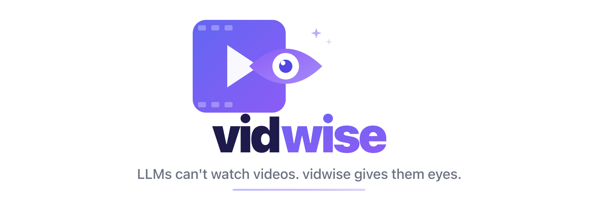

<p align="center">
  
</p>

<p align="center">
  <a href="https://pypi.org/project/vidwise/"></a>
  <a href="https://pypi.org/project/vidwise/"></a>
  <a href="https://github.com/jpdjere/vidwise/blob/main/LICENSE"></a>
  <a href="https://github.com/jpdjere/vidwise/actions/workflows/ci.yml"></a>
</p>

---

Videos are the biggest blind spot for AI. A 5-minute Loom bug report, a 30-minute tutorial, a conference talk — all completely opaque to your LLM. You either watch the whole thing yourself or lose the knowledge.

**vidwise** extracts the visual and audio knowledge from any video into structured, LLM-consumable markdown. Feed the output to any LLM and it instantly "understands" the video.

```
Video ─→ vidwise ─→ Transcript + Key Frames + Visual Guide ─→ LLM Context
```

## What can you do with it?

| Scenario | What happens |
|----------|-------------|
| **Debug a Loom bug report** | Feed the output to Claude → it "sees" the bug, the UI state, the error messages |
| **Absorb a tutorial** | 30-min coding video → structured knowledge your LLM can answer questions about |
| **Process a meeting** | Extract decisions, action items, and what was on screen |
| **Learn from a talk** | Turn any conference presentation into searchable, queryable knowledge |
| **Onboard faster** | Training videos become AI-queryable — new hires get instant answers |

## Why vidwise?

| | |
|---|---|
| **See the whole picture** | Most tools only extract audio. vidwise captures both what was *said* and what was *shown* — UI states, error messages, slides, code, diagrams. |
| **Process once, query forever** | The output is a self-contained artifact. Feed it to any LLM, any number of times, at zero additional cost. No re-uploading, no re-processing. |
| **Works with any LLM** | Standard markdown + images. Claude, GPT, Gemini, Llama, Mistral — whatever you use. No vendor lock-in. |
| **Your video stays local** | Whisper and ffmpeg run on your machine. Nothing leaves your computer unless you opt into AI guide generation. |
| **Smart, not brute-force** | Pixel-difference analysis keeps only frames where the visual content actually changed. Less noise, better LLM understanding. |
| **Human-readable AND machine-readable** | The output isn't just for LLMs — `guide.md` is a visual walkthrough you can read, share, and bookmark. One command, two audiences. |
| **One command** | `vidwise recording.mp4` → transcript, key frames, and visual guide in a single portable directory. |

> **Not just for LLMs.** The visual guide vidwise generates is a fully readable document with embedded screenshots — open it in VS Code, Obsidian, or GitHub and you have a skimmable walkthrough of the entire video. Share it with your team, bookmark it for later, or feed it to any LLM. One artifact, two audiences.

## Quick Start

```bash
# Install
pip install vidwise

# Process a local video
vidwise recording.mp4

# Process a YouTube video
vidwise https://youtube.com/watch?v=abc

# With AI-powered visual guide
export ANTHROPIC_API_KEY=sk-...   # or OPENAI_API_KEY
vidwise recording.mp4 --provider claude
```

### Prerequisites

- **Python 3.10+**
- **ffmpeg** — `brew install ffmpeg` (macOS) or `apt install ffmpeg` (Linux)

> **Lighter install?** `pip install "vidwise[fast]"` uses faster-whisper (~200MB) instead of openai-whisper (~2GB). 3-4x faster transcription, but without Apple Metal GPU support. vidwise auto-detects which backend is installed.

## Usage

```bash
vidwise <source> [options]
```

| Option | Default | Description |
|--------|---------|-------------|
| `--model`, `-m` | `medium` | Whisper model: `tiny`, `base`, `small`, `medium`, `large` |
| `--output-dir`, `-o` | auto | Output directory path |
| `--no-guide` | off | Skip AI guide generation |
| `--provider`, `-p` | `auto` | AI provider: `auto`, `claude`, `openai` |
| `--frame-interval` | `2` | Seconds between frame captures |
| `--frame-threshold` | `0.05` | Pixel diff threshold for key frame selection |

### Examples

```bash
# Fast transcription of a short video
vidwise demo.mp4 --model tiny --no-guide

# YouTube tutorial with Claude-powered guide
vidwise https://youtube.com/watch?v=abc --model small --provider claude

# Loom bug report — default settings
vidwise https://loom.com/share/abc123def
```

## Output

vidwise creates a single self-contained directory:

```
vidwise-abc123-2026-02-26/
├── video.mp4              # Source video
├── audio.wav              # Extracted audio (16kHz mono)
├── transcript.txt         # Plain text transcript
├── transcript.srt         # Timestamped subtitles
├── transcript.json        # Full Whisper output with segments
├── frames/                # Key frames every 2 seconds
│   ├── frame_0m00s.png
│   ├── frame_0m02s.png
│   ├── frame_0m04s.png
│   └── ...
└── guide.md               # Visual guide with embedded frames (if AI enabled)
```

The `guide.md` uses relative image paths — open it in any markdown viewer (VS Code, GitHub, Obsidian) and the images render inline.

## How It Works

```
┌─────────────┐
│  Video URL   │──→ yt-dlp download
│  or local    │
└──────┬───────┘
       │
       ▼
┌──────────────┐     ┌──────────────────┐
│   ffmpeg     │────→│  audio.wav       │──→ Whisper ──→ transcript.*
│  (parallel)  │     │  (16kHz mono)    │
│              │────→│  frames/         │──→ Key frame selection
│              │     │  (every 2 sec)   │    (pixel diff filtering)
└──────────────┘     └──────────────────┘
                              │
                              ▼
                     ┌──────────────────┐
                     │  AI Analysis     │  Claude API, OpenAI API,
                     │  (optional)      │  or Claude Code (free)
                     └────────┬─────────┘
                              │
                              ▼
                     ┌──────────────────┐
                     │   guide.md       │  Structured markdown with
                     │                  │  embedded frame images
                     └──────────────────┘
```

**Smart frame selection:** Not every frame matters. vidwise compares consecutive frames using pixel-difference analysis and only keeps frames where the visual content actually changed. A 10-minute video might have 300 raw frames but only ~40 meaningful ones.

## Claude Code Plugin

If you use [Claude Code](https://docs.anthropic.com/en/docs/claude-code), install vidwise as a plugin for **AI-powered guide generation without needing an API key** — Claude Code's native multimodal AI handles the analysis:

```bash
# Add the vidwise marketplace and install the plugin
/plugin marketplace add jpdjere/vidwise
/plugin install vidwise@vidwise

# Then use it:
/vidwise:vidwise recording.mp4
/vidwise:vidwise https://loom.com/share/abc123
```

For local development or testing, you can also load directly:

```bash
claude --plugin-dir /path/to/vidwise/plugin
```

The plugin runs `vidwise --no-guide` for extraction, then uses Claude Code's built-in vision capabilities to analyze frames in parallel — completely free, no API key needed.

## Whisper Model Sizes

| Model | Speed | Quality | Best For |
|-------|-------|---------|----------|
| `tiny` | ~1 min/min | Basic | Quick tests, long videos |
| `base` | ~2 min/min | Good | Short videos |
| `small` | ~4 min/min | Better | Videos >30 min |
| `medium` | ~8 min/min | Recommended | Default for most content |
| `large` | ~16 min/min | Best | When accuracy is critical |

*Speed estimates on Apple M-series. First run downloads model weights (one-time).*

## Contributing

Contributions are welcome! Please open an issue first to discuss what you'd like to change.

```bash
# Development setup
git clone https://github.com/jpdjere/vidwise
cd vidwise
python -m venv .venv
source .venv/bin/activate
pip install -e ".[dev]"

# Run tests
pytest

# Lint
ruff check src/
```

## License

[MIT](LICENSE)
